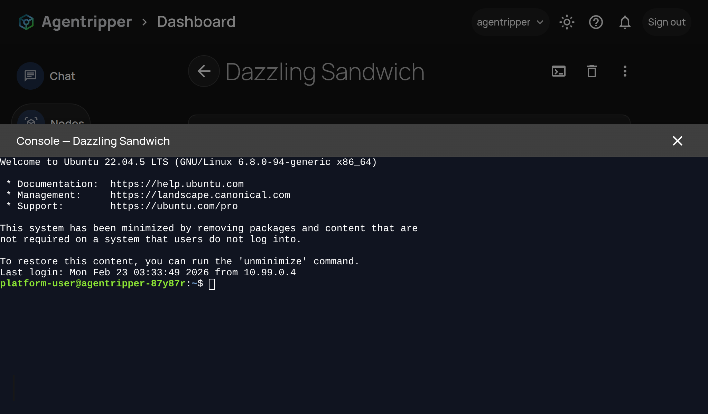

# SSH Client



SSH-2 client library for the browser (or any environment with Web Crypto and WebSockets). Connects over a WebSocket transport, performs key exchange, public-key auth, and exposes a session API for reading/writing and PTY control.

**Install:** `npm install ssh2webclient`  
**Use in another project:** Point your bundler at the package or copy this directory; the package builds with `npm run build` (output in `dist/`).

## Public API

```typescript
import { connectSSH } from "ssh2webclient";

const conn = await connectSSH(
  ws,                                    // WebSocket (binary)
  { username, certificate, privateKey },  // credentials
  onError,                                // (err: string) => void
  { cols, rows, onPtyDenied }            // optional: terminal size, pty callback
);

conn.onData(data => { /* handle server output */ });
conn.write(userInput);
conn.resize(cols, rows);
conn.close();
```

Types: `SSHConnection`, `ConnectSSHOptions`, `SSHCredentials`. Errors: `SSHError`, `KEXError`, `AuthenticationError`, `MacVerificationError`, `ProtocolError`, `ChannelError`, `ParseError` (exported from the same module).

## Architecture

| Layer | Purpose |
|-------|---------|
| **domain/** | Models, constants, errors |
| **crypto/** | Digest, cipher, MAC, DH/X25519, key derivation |
| **protocol/** | Packet codec, serialization, deserialization |
| **transport/** | AES-CTR + HMAC, sequence numbers |
| **kex/** | KEXINIT builder, KEX state |
| **auth/** | Auth state, cert parsing, PEM + Ed25519 sign |
| **channel/** | Channel state |
| **connection/** | Orchestrator and public types |

## Directory layout

```
sshClient/
  index.ts                   (public API)
  ARCHITECTURE.md
  REFACTORING.md
  domain/                    constants, errors, models
  crypto/                    digest, cipher, mac, arithmetic, keyexchange, keys (+ *.test.ts)
  protocol/                  serialization, deserialization, codec, messages (+ *.test.ts)
  transport/                  transportcipher (+ *.test.ts)
  kex/                       kexstate, builder (+ *.test.ts)
  auth/                      authstate, certparser, keys (+ *.test.ts)
  channel/                   channelstate (+ *.test.ts)
  connection/                connectSSH, connectionstate, types
```

## Testing

From the package directory:

```bash
npm run test
```

With coverage:

```bash
npm run test -- --coverage
```

### Coverage (Vitest, v8)

Latest run (82 tests, 19 files):

| Metric     | Coverage |
|-----------|----------|
| Statements| 43.1%    |
| Branches  | 27.6%    |
| Functions | 54.1%    |
| Lines     | 43.4%    |

| Area       | Stmts | Lines |
|------------|-------|-------|
| auth       | 90.5  | 88.2  |
| crypto     | 100   | 100   |
| domain     | 76.8  | 84.1  |
| kex        | 82.4  | 78.6  |
| protocol   | 73.9  | 78.3  |
| transport  | 84.4  | 89.2  |
| channel    | 50    | 50    |
| connection | 1.0   | 1.1   (orchestrator largely integration) |

Unit tests are colocated (`*.test.ts`). The connection orchestrator is exercised by end-to-end use; crypto, protocol, transport, auth, and state layers are unit-tested.

## Design principles

- **KISS** – Simple, direct implementations  
- **Single responsibility** – One concern per module  
- **Layered** – Domain to crypto to protocol to transport to connection  
- **Test-friendly** – Layers testable in isolation  

## Data flow

```
Caller
  |
  connectSSH(ws, creds) -> connection/connectSSH
    - Version exchange (client/server ident)
    - KEX (KEXINIT, KEXDH/KEX_ECDH, NEWKEYS)
    - Key derivation, transport cipher
    - Service request (ssh-userauth)
    - USERAUTH (publickey, cert + signature)
    - CHANNEL_OPEN session, pty-req, shell
    - Returns SSHConnection
         - write(data)
         - onData(cb)
         - resize(cols, rows)
         - close()
```
